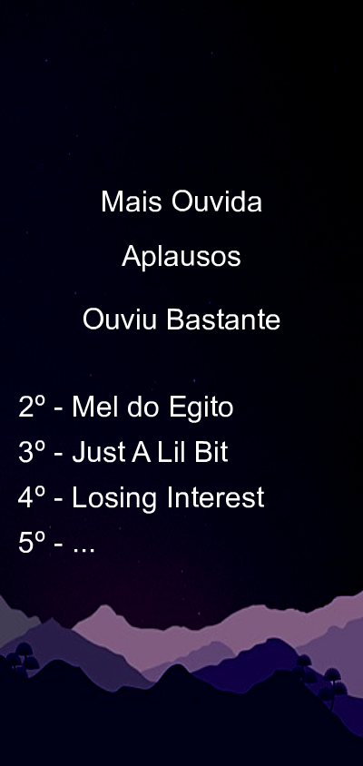
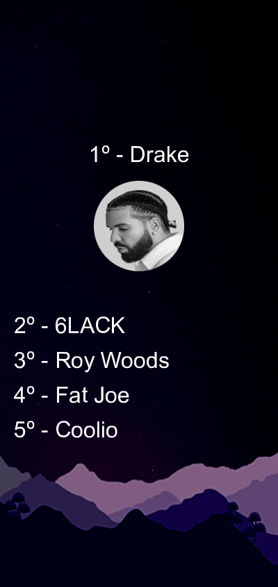
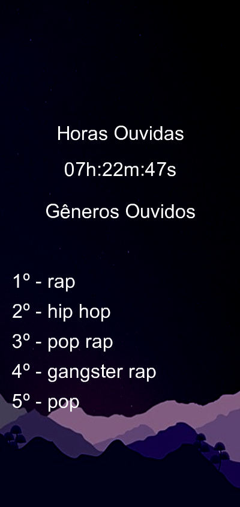

# 🎶 Weekly-summary

## About
This is an application for creating a weekly summary based on the user's Spotify data, creating images from that extraction, and posting on the user's Twitter
<br>


## How it works
After the user registers his credentials, the application is pre-programmed to extract the songs listened to by the user on a daily basis. On Sundays, the application is programmed to perform an analysis of which songs were listened to, which artists, genres and plots the result of the analysis in an image.

## Get Started
- First, install the dependencies using ```yarn install``` or ```npm install``` depending on your preferred package manager
- Before starting, you should have:
     - A Mongo connection, Atlas was used in this application
     - Credentials for an application on Spotify
     - Credentials for the bot in Telegram (Optional)
- Create a ```.env``` file to store application-sensitive data, such as credentials and the mongo connection
```.env
PORT=<A production or development port>
SPOTIFY_CLIENT_ID=<Spotify Application Client ID>
SPOTIFY_CLIENT_SECRET=<Spotify Application Client Secret>
CONFIG_SECRET=<Secret that will be used for encryption>
CONFIG_EXPIRES_IN=<Expiration setting using encryption>
STRING_CONNECTION=<String connection to your mongo>
SPOTIFY_BASE_URL=<URL used to use spotify api>
BOT_TOKEN=<Telegram Token>
CHAT_ID=<Telegram chat id>
```
With these environment variables configured we can run our application.


## running
For the execution, some scripts were created inside the application
- dev: Run the command ```yarn dev``` or ```npm run dev``` to run the application with nodemon for development, it will reload the application whenever a new change is saved

The application has four routes, all of the GET type:
- ```GET``` ```/``` : main route, returning only some basic data about application and author
- ```POST``` ```/user```: route responsible for user registration.
- ```POST``` ```/user/credentials```: route responsible for registering the user's spotify and twitter credentials
- ```POST``` ```/login``` : route responsible for user authentication and login

## Examples
* Most Listened songs
    * 
* Most Listened Artists
    * 
* Most Listened Genres and Total of Listened Hours
    * 
## References
* Dependencies
    * [Axios](https://www.npmjs.com/package/axios)
    * [Dotenv](https://www.npmjs.com/package/dotenv)
    * [Express](https://www.npmjs.com/package/express)
    * [Mongoose](https://www.npmjs.com/package/mongoose)
    
* Documentations
    * [Express](https://expressjs.com/en/5x/api.html)
    * [Axios](https://axios-http.com/ptbr/docs/intro)
    * [Mongoose](https://mongoosejs.com/docs/guide.html)
    * [Spotify Api](https://developer.spotify.com/documentation/web-api/tutorials/getting-started)
    * [Telegram](https://core.telegram.org/bots/api)
## Autor
*Guilherme Ventura Santos Silva [GVSS]*

[](https://twitter.com/gventura_ss) [](https://www.linkedin.com/in/gvssilva/)
